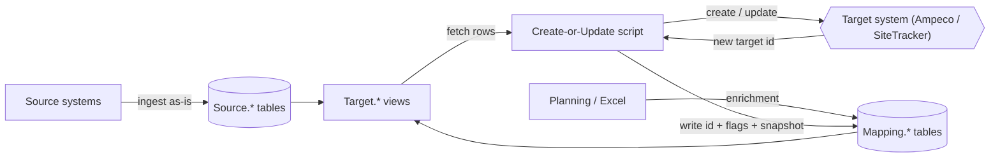

# Migration Pattern Guide

> **Audience:** A developer or coding agent setting up a **new** migration project from scratch.
> **Goal:** Describe the database-driven migration pattern we use to load data into external
> target systems, independent of any specific project.
>
> This guide captures the **current** version of the pattern. Where the codebase still contains
> older variants, they are called out under [Legacy Patterns](#legacy-patterns--do-not-replicate)
> so you can recognise them in reference files and avoid copying them into a new project.

## Table of Contents

- [1. Concept](#1-concept)
- [2. Target Systems](#2-target-systems)
- [3. Data Flow Overview](#3-data-flow-overview)
- [4. The Orchestrator (Run All)](#4-the-orchestrator-run-all)
- [5. Target Views](#5-target-views)
- [6. Create-or-Update Scripts](#6-create-or-update-scripts)
- [7. Mapping Tables](#7-mapping-tables)
- [8. The Enrichment Layer](#8-the-enrichment-layer)
- [9. Cross-Cutting Conventions](#9-cross-cutting-conventions)
- [10. Legacy Patterns — Do NOT Replicate](#legacy-patterns--do-not-replicate)
- [11. New Project Checklist](#11-new-project-checklist)

---

## 1. Concept

A migration moves data from one or more **source systems** into one or more **target systems**.
We do not transform-and-push in one monolithic script. Instead we use a **database as the
staging and contract layer**:

1. **Source data** is loaded into the database as-is (one schema, `Source`).
2. **Enrichment data** (project planning, decisions that don't exist in the source) is loaded
   into mapping/enrichment tables (`Mapping`).
3. **Target views** (`Target` schema) shape the data into rows that map almost 1:1 to the
   payload of the target system's API.
4. **Create-or-update scripts** read one target view each, call the target API, and write the
   resulting target ID back into a **mapping table**.
5. The whole run is **idempotent** — re-running picks up where it left off and updates what
   already exists rather than duplicating it.

The database is the single source of truth for *what* to migrate and *what has already been
migrated*. The Python scripts are thin: fetch rows → build payload → call API → record the ID.

### Why this shape

- **Separation of concerns.** All business logic lives in SQL views (versioned DDL, easy to
  diff and test). Python stays generic and reusable across resources.
- **Observability.** You can inspect exactly what *would* be sent by selecting from a target
  view, before any API call is made.
- **Restartability.** Because target IDs are persisted in mapping tables and joined back into
  the views, a crashed or partial run can be resumed safely.

---

## 2. Target Systems

A project may load into one or both of the following. Each has its own API wrapper and its own
set of create-or-update scripts and target views.

### Ampeco

EV charging management platform, accessed through a **REST API**. Resources include partners,
locations, charge points, EVSEs, connectors, tariffs, users, and ID tags. Calls go through a
thin wrapper that injects the auth header, retries on network errors, and validates the
response status code. Create returns `201` with the new object; update is a `PATCH` returning
`200`.

### SiteTracker

Asset / site-management system built on **Salesforce**, accessed through the Salesforce REST
API (sObjects + SOQL). Resources include Sites, Accounts, Site Relations, and Field Assets
(chargers, routers, SIM cards). Because it is Salesforce, records can be **looked up by SOQL**
before creating — this enables matching against records that already exist in the target
(see [lookup-before-create](#63-lookup-before-create)). Create returns an `id`; update is a
`PATCH` returning `204`.

> The **SiteTracker scripts are the most recent** and carry the current best version of the
> mapping/idempotency pattern. When in doubt, copy a SiteTracker script, not an older Ampeco one.

---

## 3. Data Flow Overview



The loop between the script, the target system, and the mapping table is what makes the run
idempotent: the ID written back into `Mapping.*` is joined into `Target.*` on the next run, so
the view tells the script whether each row still needs creating or already exists.

### Database schemas

| Schema    | Contents                                                                 | Drop behaviour                          |
|-----------|--------------------------------------------------------------------------|-----------------------------------------|
| `Source`  | Raw imported source data and normalization views.                        | Tables persistent; views recreated.     |
| `Mapping` | Enrichment tables **and** mapping tables (migration state + target IDs).  | **Never drop** — holds migration state. |
| `Target`  | Views that produce API payloads (one per target resource).                | Always dropped and recreated.           |
| `Reports` | Analysis / quality views. *(Out of scope for this guide.)*                | Always dropped and recreated.           |

---

## 4. The Orchestrator (Run All)

A single entry point runs every step in dependency order. Each step is one create-or-update
script. The orchestrator does nothing but call them in sequence and log progress.

### Ordering

Steps run in an order such that a resource is created **before** anything that references it.
A representative order (omit the resources a project doesn't use):

1. Users
2. ID Tags *(needs Users)*
3. Partners
4. Partner Contracts *(needs Partners)*
5. Locations
6. Charging Zones *(needs Locations)*
7. User Groups *(needs Partners)* and User Group Members *(needs User Groups + Users)*
8. Subscription Plans *(needs Partners)*
9. Tariff Groups + Base Tariffs *(needs Partners)*
10. Charge Points *(needs Partner Contracts + Locations)*
11. Electricity Meters
12. Circuits *(needs Electricity Meters)*
13. EVSEs + Connectors *(needs Charge Points + Tariff Groups)*
14. Charge Point ↔ Circuit attachment *(needs Charge Points + Circuits)*
15. Partner Invites *(needs Partners + Users)*
16. Partner Admins *(needs Partners)*
17. SiteTracker Sites
18. SiteTracker Accounts
19. SiteTracker Site Relations *(needs Sites + Accounts)*
20. SiteTracker Field Assets *(needs Sites; chargers/routers/SIMs)*

> The exact list is project-specific. What matters is that **dependencies are created first**,
> because the dependent view filters on (or embeds) the parent's target ID, which only exists
> after the parent step has run.

### Idempotency is a hard requirement

Every step must be safe to run any number of times. A re-run must **never** create duplicates.
This is achieved by the combination of:

- the target view exposing the already-known target ID (`NULL` ⇒ not yet created), and
- the script updating existing rows and only creating rows that have no target ID, and
- the mapping write being **atomic and verified** (see [§7](#7-mapping-tables)).

Treat "the full pipeline can be re-run end to end without harm" as an invariant when adding any
new step.

---

## 5. Target Views

A target view is the **contract** between SQL and the create-or-update script. It is structured
in three clearly-commented sections, always in this order: **Source**, **Target IDs**,
**Payload**.

```sql
DROP VIEW IF EXISTS "Target"."Widgets" CASCADE;
CREATE VIEW "Target"."Widgets" AS
SELECT
    -- ── SOURCE ──────────────────────────────────────────────
    'Proj|Widget|' || s."Id"::TEXT            AS mapping_key,
    s.project_code,
    s.project_code || '/' || s.widget_name    AS source_label,

    -- ── TARGET ID(S) ───────────────────────────────────────
    wm.target_widget_id                       AS "TargetWidgetId",

    -- ── PAYLOAD (API field names, 1:1, in API order) ───────
    s.widget_name                             AS "name",
    s.status                                  AS "status",
    s.lat                                     AS "geoposition_latitude",
    s.lon                                     AS "geoposition_longitude",
    parent_m.target_parent_id                 AS "parentId"
FROM "Source"."Widgets" s
LEFT JOIN "Mapping"."widget_mapping" wm
    ON wm.mapping_key = 'Proj|Widget|' || s."Id"::TEXT
LEFT JOIN "Mapping"."parent_mapping" parent_m
    ON parent_m.mapping_key = 'Proj|Parent|' || s.parent_guid::TEXT
WHERE /* dependency gate, see below */ ;
```

### 5.1 Source section

Columns the script needs to identify the row, independent of the source system's own column
names:

- **`mapping_key`** — a stable, explicit, globally-unique key for this entity. We build it as a
  composite string, e.g. `Proj|Widget|{source_guid}`. It is the join key to the mapping table
  and the key the script writes back under. Make it deterministic from source data so re-runs
  produce the same key.
  - ⚠️ **The middle segment names the SOURCE table/entity, never the target system's name for
    it.** Use the literal source table name (e.g. `Customer`, `Facility`) — not the name of the
    target view, the target API resource, or the target system (`SiteTrackerAccount`,
    `SiteTrackerSite`, `Location`, ...). A grain of "one X per `source.customer`" gets
    `Proj|Customer|{id}`, even if the target view/table is called `sitetracker_accounts` and
    the API resource is Salesforce "Account". This keeps the key meaningful when the *same*
    source row feeds multiple target views (e.g. `laddel.customer` feeds both `target.partners`
    as `Laddel|Customer|{id}` and `target.sitetracker_accounts` as `Laddel|Customer|{id}` — same
    segment, different mapping tables, no collision since each mapping table is its own
    namespace) and when one target view is later renamed or a second target system is added for
    the same source entity.
- **`source_label`** — a human-readable label used **only for logging**. It lets the script log
  something meaningful (e.g. `NORD-12/Charger A3`) without the script knowing the source
  system's ID column names. Compose it from several fields when that gives better context —
  e.g. `project + charger + evse` — so a log line uniquely identifies the thing across the run.
- Any other grouping/identity columns the script needs (e.g. `project_code`).

### 5.2 Target ID section

One column per related **target** ID, resolved by `LEFT JOIN` to a mapping table:

- The row's **own** target ID (e.g. `TargetWidgetId`) — `NULL` means "not created yet".
- Optionally, **parent** target IDs used to embed foreign keys in the payload.

These IDs serve two purposes:

1. **Idempotency / debug** — the script reads its own target ID to decide create vs. update,
   and the columns make the view easy to inspect.
2. **Dependency gating (older usage, still valid)** — a view may filter out rows whose parent
   isn't created yet, or skip rows already created, with a `WHERE` clause such as
   `WHERE parent_m.target_parent_id IS NOT NULL`. This both prevents premature creation and
   speeds up large re-runs by not re-emitting completed rows. Use it for hard dependencies; for
   soft/optional references just include the ID in the payload and let it be `NULL`.

### 5.3 Payload section

The remainder of the view is the **payload**. Rules:

- **Map 1:1 to the target API.** Each payload column name is the API field name, used verbatim
  by the script. The script should be able to build most of the body by iterating a list of
  payload column names.
- **Column order matches the API call** / documented field order. This keeps the view readable
  next to the API reference and makes diffs obvious.
- **Nested objects use `_` instead of `.`** — a field `geoposition.latitude` becomes a column
  `geoposition_latitude`. The script (or a small helper) re-nests these into objects.
- **Exceptions, kept deliberately small:**
  - **Translations / locale arrays** — columns like `name_en`, `name_sv` are folded into an
    array of `{locale, translation}` objects by the script rather than sent 1:1.
  - **Special / derived values** — e.g. generated passwords, secrets, or values that require
    runtime resolution (looking up a target ID by name) are handled in the script, not emitted
    raw from the view.

> **Keep the payload section pure.** If a value can be computed in SQL, do it in the view. The
> script's job is transport, not business logic.

---

## 6. Create-or-Update Scripts

Every resource has one script. They all follow the same shape so that reading one means you can
read them all.

### 6.1 The general algorithm

```text
main():
    authenticate to target system
    rows = SELECT * FROM Target.<Resource>        # the whole view
    if no rows: log and return
    for each row (log progress every N):
        process(row)
    log summary (created / updated / skipped / errors)
    exit non-zero if any error

process(row):
    if row.TargetId is not NULL:
        # already mapped → update
        before   = snapshot(row.TargetId)         # read current target state
        payload  = build_payload(row)
        log_field_diffs(before, payload)          # record what will change
        update(row.TargetId, payload)
    else:
        # not mapped yet
        existing = lookup_existing(row)           # optional, see 6.3
        if existing:
            update(existing.id, build_payload(row))
            write_mapping(row, existing.id, existed_before=True,  snapshot=before)
        else:
            id = create(build_payload(row))
            write_mapping(row, id,          existed_before=False, snapshot=None)
```

### 6.2 Building the payload

`build_payload(row)` turns the view's payload columns into the API body:

- Read payload columns 1:1 (often from a hard-coded `PAYLOAD_COLUMNS` list that mirrors the
  view).
- Drop `None`/empty values so you don't overwrite target fields with blanks.
- Re-nest `a_b` columns into `{"a": {"b": ...}}`.
- Serialize dates to the format the API expects.
- Apply the few documented exceptions (translation arrays, runtime-resolved IDs, secrets).

### 6.3 Lookup-before-create

Newer scripts (all SiteTracker ones) try to **find an existing target record before creating**,
using a natural key (serial number, org number, name, project code, …). This is what makes a
re-run able to **recover an orphan** (a record created in the target whose mapping write never
landed): instead of blindly creating a duplicate, the script finds the existing record, adopts
its ID, updates it, and records the mapping with `existed_before = TRUE`.

Not every resource has a reliable natural key, so **not all scripts can do this**. That is
exactly why the mapping write is protected by a hard halt (next section): for scripts without
lookup, a lost mapping is unrecoverable automatically.

---

## 7. Mapping Tables

Mapping tables are the **migration state**. They are in the `Mapping` schema, are
`CREATE TABLE IF NOT EXISTS` (extended with `ALTER TABLE ... ADD COLUMN IF NOT EXISTS`), and are
**never dropped**.

### 7.1 Current schema (the SiteTracker pattern)

One dedicated mapping table per resource, INSERT-based (one row written per created/adopted
resource):

```sql
CREATE TABLE IF NOT EXISTS "Mapping"."widget_mapping" (
    mapping_key                      TEXT PRIMARY KEY,   -- e.g. Proj|Widget|{guid}
    target_widget_id                 TEXT,               -- id returned by the target system
    widget_existed_before_migration  BOOLEAN,            -- TRUE = adopted an existing record
    matched_by                       TEXT,               -- how it was matched: created | org_number | name | serial | ...
    previous_record_snapshot         JSONB               -- full pre-update state, only when adopted
);
```

Field meanings:

- **`mapping_key`** — primary key, the same composite key the target view emits.
- **`target_<resource>_id`** — the ID returned by the target system. This is the value joined
  back into the target view.
- **`<resource>_existed_before_migration`** — a flag: `FALSE` when we created the record,
  `TRUE` when we matched and **adopted** a record that already existed in the target.
- **`matched_by`** — *(use where a record can be matched several ways)* records which natural
  key matched (`created`, `org_number`, `name`, `serial`, …). Invaluable when auditing why a
  record was adopted.
- **`previous_record_snapshot`** — the full JSON of the target record **as it was before we
  touched it**, captured only when we adopt/update a pre-existing record. This is our undo /
  audit trail: it tells us exactly what we overwrote on a record we did not create.

### 7.2 Normalise the mapping key — always

> ⚠️ **Hard-won lesson.** The `mapping_key` is the join key between the view and the mapping
> table. If the *same* entity produces two **different** key strings on two runs, the join
> silently fails and you create a **duplicate** in the target system.

Source exports are inconsistent about GUID casing and formatting — the same GUID can appear as
`A1B2C3D4-...`, `a1b2c3d4-...`, or mixed case across files, sometimes with/without braces or
surrounding whitespace. **Normalise every component of the key before you build it, and apply
the exact same normalisation on both sides of the join:**

- Pick a canonical form (e.g. **lower-case**, trimmed, no braces) and use it **everywhere**:
  when constructing `mapping_key` in the target view *and* anywhere the key is built in Python.
- Do the normalisation in SQL too (`LOWER(btrim(...))`) so the view and the table agree.
- Treat the key as opaque and deterministic: the same source entity must always yield the
  byte-identical key.

A mismatched-case GUID is invisible in a quick glance at the data but produces orphans and
duplicates at scale. Bake normalisation into the key from day one.

### 7.3 Mapping tables are hard-coded in the script

Each script **hard-codes the name of the mapping table it writes to**. The target view does
**not** carry a `mapping_table` column anymore.

> **Lesson learned:** the older approach put a `mapping_table` column in the view and the script
> dispatched on it at runtime. In practice that value was effectively static per resource, so
> the indirection added complexity for no benefit. Hard-code the table name in the script and
> keep the view focused on data.

### 7.4 Write the mapping atomically, and **halt hard** if it fails

After a create (or adopt), the script writes the mapping row and **verifies the write affected
exactly the expected number of rows**. If it didn't, the script **aborts the entire run**
(`SystemExit`), it does not just log and continue:

```python
def write_mapping(conn_str, row, target_id, existed_before, matched_by, snapshot):
    # Machine-readable breadcrumb BEFORE the write, so a crash here is manually recoverable:
    logging.info(f"MAPPING_RECORD|mapping_key={row.mapping_key}|target_id={target_id}")
    try:
        with get_db_connection(conn_str) as conn, conn.cursor() as cursor:
            cursor.execute(
                '''INSERT INTO "Mapping"."widget_mapping"
                       (mapping_key, target_widget_id,
                        widget_existed_before_migration, matched_by, previous_record_snapshot)
                   VALUES (?, ?, ?, ?, ?)''',
                (row.mapping_key, target_id, existed_before, matched_by,
                 json.dumps(snapshot) if snapshot else None),
            )
            if cursor.rowcount == 0:
                raise SystemExit(
                    f"Mapping INSERT affected 0 rows for {row.mapping_key}; "
                    f"halting to prevent an orphaned resource in the target system."
                )
            conn.commit()
    except SystemExit:
        raise
    except Exception as e:
        raise SystemExit(
            f"Mapping write failed for {row.mapping_key} (id={target_id}): {e} — "
            f"halting to prevent orphaned resources."
        )
```

> ### ⭐ The single most important line: log `mapping_key` + target ID **before** the write
>
> ```python
> # Machine-readable, written to the log file BEFORE attempting to store the mapping:
> logging.info(f"MAPPING_RECORD|mapping_key={row.mapping_key}|target_id={target_id}")
> ```
>
> This one log line is the **last line of defence against losing track of a created resource**.
> Emit it **immediately after** the target system returns the new ID and **before** the mapping
> INSERT. Keep it **machine-readable** (stable `KEY|field=value|field=value` format) so it can be
> grepped and parsed for recovery.
>
> It protects against **two** distinct failure modes:
>
> 1. **The mapping write fails and the run aborts.** The breadcrumb holds the `mapping_key` ↔
>    `target_id` pair, so the mapping row can be inserted by hand and the run resumed.
> 2. **The mapping write fails *silently* and the rowcount check does not catch it.** Even if our
>    own safety check is bypassed somehow, the pair is still in the log file — so we can
>    reconcile the log against the mapping table afterwards to **find orphans** (IDs in the log
>    that never made it into the table) or **rebuild the mapping table** from the log entirely.
>
> Without this line, a created resource whose ID never reached the database is effectively
> invisible: an orphan we cannot find and cannot safely re-create around. **Always log it.**

**Why halting is so aggressive — and why the breadcrumb matters.** (Hard-won from experience.)

- The dangerous moment is *after* a resource is created in the target but *before* its ID is
  safely persisted. If the mapping write silently fails and the run continues, we now have an
  **orphan**: a real object in the target system that our database doesn't know about.
- On the next run, a script **without** [lookup-before-create](#63-lookup-before-create) has no
  way to discover that orphan and will happily create a **duplicate**.
- So the moment a mapping write is in doubt, we stop the whole pipeline. A halted run is easy to
  fix; a pile of duplicates in a production target system is not.
- The `MAPPING_RECORD|...` breadcrumb (above) is the safety net that lets us recover whether the
  process aborts cleanly *or* the integrity check fails to fire.

### 7.5 Snapshot the original before adopting an existing record

When a script **adopts** a pre-existing target record (via
[lookup-before-create](#63-lookup-before-create)) and updates it, capture the record's full
state **before** touching it:

- Store it as `previous_record_snapshot` (JSON) on the mapping row.
- Log every field the update will change (`log_field_diffs`, `old → new`).

This gives us a per-record **undo / audit trail**: we know exactly what a record looked like
before migration touched it, so a bad update can be diffed and reverted. This is purely about
*target-system* data safety and is separate from how we write the mapping itself (next).

### 7.6 Avoid UPSERT / UPDATE when writing the mapping table

> ⚠️ **We are deliberately afraid of `UPSERT` and `UPDATE` against mapping tables. Avoid them.**

Writing a newly-created resource's ID should be a plain **`INSERT`** into an initially-empty,
per-resource table. We avoid `UPDATE ... SET target_id WHERE mapping_key` and
`INSERT ... ON CONFLICT DO UPDATE` because:

- **They can overwrite an existing, correct mapping key.** An `UPSERT` on a key that already
  holds a valid target ID will clobber it — pointing us at the wrong resource, or losing the
  link to a real one.
- **A failed `UPDATE` is silent.** `UPDATE` matching 0 rows is *not* an error to the database;
  without a rowcount check it just stores nothing, and we never learn the ID was lost. `INSERT`
  into a fresh row is far easier to verify and far harder to silently no-op.

**Why the old code used UPDATE anyway.** Older mapping tables packed **several target IDs into
one shared table** — commonly a single `location_mapping`/project-code table holding
`target_location_id`, `target_partner_contract_id`, `target_charge_zone_id`, … Because a row was
pre-created per source entity (for the location step), later steps had to **`UPDATE`** their
column into that existing row. That is the pattern that forces UPDATE and brings all its risks.

**Do this instead: one mapping table per target resource.** With a dedicated table per
resource, the table starts empty and every write is a clean `INSERT` of exactly one new row —
no shared rows to update, no keys to clobber, and a trivial `rowcount == 1` check. If you ever
find yourself needing `UPDATE`/`UPSERT` to store a created ID, that is a signal you've put two
resources in one table; split them.

If you must work with a legacy shared/UPDATE-based table, treat every write as dangerous:
verify rowcount, never overwrite a non-null target ID, and test the exact overwrite scenarios
before running against a live target.

---

## 8. The Enrichment Layer

Source systems rarely contain everything needed to migrate. **Enrichment** is the data we add
from project planning — decisions and metadata that live outside the source system, typically
maintained in an **Excel workbook** and imported into a `Mapping` enrichment table (e.g.
`location_mapping`).

### 8.1 Typical enrichment data

- **Project code** — the migration batch / partner project a row belongs to.
- **Status** — where the row is in the migration lifecycle (see below).
- **Migration date** — planned or actual cut-over date.
- **Merges** — instructions to merge several source locations into one target location
  (e.g. a `merge_with_mapping_key` pointing rows at a single survivor).
- **Name overrides** — a curated display name that supersedes the source's name.
- **Business model & fees** — partner model (owned vs. resell vs. MDU), monthly fees, per-EVSE
  pricing, operator/partner revenue split, etc.
- **Per-target inclusion flags** — e.g. a boolean that turns a location on for a particular
  target system.

The enrichment table is keyed by the same `mapping_key` convention and is joined into the
target views alongside the source data.

> **Ingesting the Excel.** Earlier projects loaded the planning workbook with a
> `FetchFromSharePoint`-style script (pull the workbook via the Microsoft Graph API, validate
> columns against a config file, write into a `Mapping`/`Source` table, optionally run
> post-import SQL). That pattern is a reasonable **starting point** if you need Excel ingestion
> — you can copy its shape — but treat it as something to **improve** for a new project rather
> than lift verbatim (clearer config, stricter validation, better idempotency). The mechanics of
> *how* the Excel is ingested are otherwise out of scope for this guide.

### 8.2 Status drives what gets migrated

A **status** column on the enrichment row controls **which rows the target views emit**. As a
row progresses through the lifecycle, it becomes eligible for more of the pipeline. A common
progression:

```text
(planning) → migrate → ready → done
```

- Rows not yet marked for migration are excluded from every target view.
- A row at the appropriate status is included; views filter on it (often via a derived boolean
  such as `load_to_<system> = TRUE WHEN status IN ('ready','done')`).
- This lets you **stage a migration**: flip a handful of rows to the active status, run the
  pipeline against just those, verify, then widen the set — all without code changes.

Put the status gate in the **view's `WHERE`** so a single flag in the enrichment table cleanly
controls scope for the whole pipeline.

---

## 9. Cross-Cutting Conventions

### 9.1 Logging — record what changed, when, and what failed

- Initialise logging once per script to a timestamped file **and** the console.
- Log the decision for every row: `CREATED` / `UPDATED` / `SKIPPED` with the `source_label` and
  the resulting target ID.
- On update, log **per-field diffs** (`old → new`) so there is a durable record of exactly what
  was changed on records we did not originally own.
- Emit the machine-readable `MAPPING_RECORD|mapping_key=...|target_id=...` breadcrumb **before**
  every mapping write \u2014 see [§7.4](#74-write-the-mapping-atomically-and-halt-hard-if-it-fails).
  This is the line that lets us recover orphans / rebuild the mapping table if a write is lost.
- Log progress every N rows on long loops (e.g. every 50–1000).
- End with a summary block (counts + the list of errors).

The logs are the audit trail of the migration: who/what/when, and what failed for later retry.

### 9.2 Retries

Wrap target-system calls with **exponential-backoff retry** on transient/network errors only
(e.g. `tenacity` with `stop_after_attempt(3)` and `wait_exponential`). Retry connection errors;
do **not** silently retry semantic failures (a `422`/validation error should surface, not loop).
Handle `401` by invalidating the cached token and retrying once.

### 9.3 Fail fast; avoid defensive coding

- **Validate at boundaries, then trust.** Check the response status code right after each API
  call and raise immediately on the unexpected. Don't sprinkle defensive `if`/`try` around code
  paths that can't actually occur.
- **Halt on integrity risks** — a mapping write that affects 0 rows, a target view that returns
  0 rows when rows are expected, or "no valid mapping condition" all justify `SystemExit`.
- **Let per-row business errors be caught, counted, and reported** — one bad row should be
  logged and tallied (and force a non-zero exit at the end), but it should not abort the whole
  run the way an integrity violation does. Distinguish "this row failed" (collect & continue)
  from "the system is in an unsafe state" (halt now).
- Don't write fallbacks for impossible inputs; it hides real problems.

### 9.4 Future improvement: aggregate stats at the orchestrator level

Today each script logs its own per-run summary (created / updated / skipped / errors), but the
**orchestrator does not aggregate across steps**. A run can finish with warnings and per-row
errors scattered through many individual logs, with no single roll-up.

For upcoming projects, improve this: have the orchestrator **collect each step's counts and its
warnings/errors**, and print one **consolidated end-of-run report** (per-step totals, a grand
total, and every warning/error gathered in one place), exiting non-zero if any step reported
errors. This makes it far easier to judge the health of a full migration run at a glance instead
of grepping N log files.

---

## Legacy Patterns — Do NOT Replicate

The codebase has evolved. When you open an **older** reference script (typically the Ampeco
ones) you may see the following. **Do not carry these into a new project** — prefer the current
pattern described above.

| Legacy pattern (older files) | Current pattern (use this) |
|------------------------------|----------------------------|
| A **`mapping_table` column in the target view**, with the script dispatching on it at runtime. | **Hard-code** the mapping table name in the script; drop the column from the view. |
| `update_*_mapping()` with a chain of `hasattr(row, "SourceXxxID")` branches to support multiple source systems / dialects (`StationMapping`, `LocationMapping` MSSQL vs PG, …). | One dedicated, INSERT-based mapping table per resource with a single, explicit write. |
| **UPDATE-based** mapping: pre-populate a mapping row for every source row, then `UPDATE ... SET target_id WHERE mapping_key`. | **INSERT-based** mapping: table starts empty; insert one row per created/adopted resource, with `existed_before`, `matched_by`, and `previous_record_snapshot`. |
| `INSERT ... ON CONFLICT (mapping_key) DO UPDATE` upserts, or SQL-Server `[Mapping].[Table]` with `SourceXxxID`/`TargetXxxID` columns. | Plain INSERT + `rowcount` verification + hard halt on failure. |
| No `existed_before` / `matched_by` / snapshot — create-only, no way to adopt pre-existing target records. | Capture all three; support [lookup-before-create](#63-lookup-before-create) wherever a natural key exists. |
| Per-source-system identity columns (`SourceStationID`, `SourceLocationID`, …) leaking into views and scripts. | A single opaque, composite `mapping_key` plus a `source_label` for logging. |

If you must touch a legacy script, it's fine to leave it working as-is — just don't use it as
the template for new resources.

---

## 11. New Project Checklist

To stand up a new migration project:

1. **Schemas.** Create `Source`, `Mapping`, `Target` (and `Reports` if needed).
2. **Ingest source data** into `Source.*` (out of scope here — however you load it).
3. **Enrichment table(s)** in `Mapping` keyed by `mapping_key`, carrying project code, status,
   migration date, merges, name overrides, business model/fees, and per-system inclusion flags.
   Use `CREATE TABLE IF NOT EXISTS`; never drop.
4. **Per-resource mapping tables** in `Mapping` using the
   [current schema](#71-current-schema-the-sitetracker-pattern)
   (`mapping_key`, `target_*_id`, `*_existed_before_migration`, `matched_by`,
   `previous_record_snapshot`). Never drop.
5. **Target views** in `Target`, one per resource, in the three-section
   [Source / Target IDs / Payload](#5-target-views) layout, gated by the status flag and by
   parent target IDs.
6. **API wrapper** per target system: auth header injection, token refresh on `401`,
   exponential-backoff retry on network errors, status-code validation.
7. **Create-or-update scripts**, one per resource, following the
   [general algorithm](#61-the-general-algorithm): fetch view → per-row create/adopt/update →
   atomic, verified mapping write with **hard halt on failure** → summary + non-zero exit on
   row errors. Add [lookup-before-create](#63-lookup-before-create) wherever a natural key
   exists.
8. **Orchestrator** that runs the scripts in dependency order and is safe to re-run end to end.
9. **Logging** wired into every script (file + console, per-row decisions, field diffs,
   `MAPPING_RECORD` breadcrumbs, summary).
10. **Verify idempotency** by running the whole pipeline twice against a test target and
    confirming the second run creates nothing and only updates.
