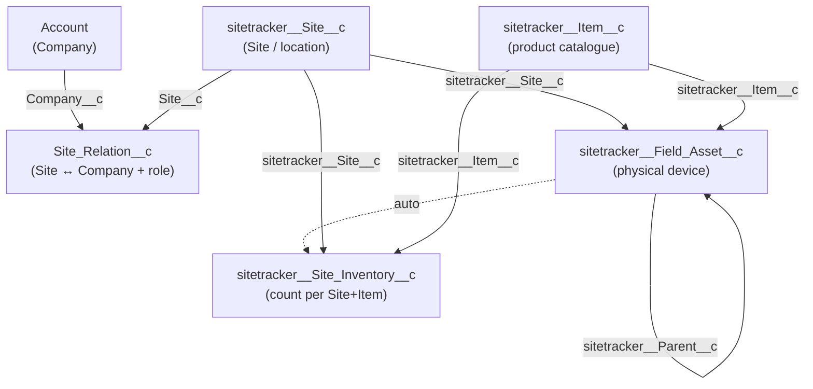

# SiteTracker (Salesforce) API reference

> **Provenance & status.** This guide is **reference material**, distilled from research in
> the earlier `projectsaturn` migration (Wattif). It documents the **SiteTracker on
> Salesforce** REST/SOQL API, its sobjects, fields, picklists, and the create-or-update
> patterns that project used. It is **not** wired into `ladmig` and describes a system this
> project does not yet target.
>
> ⚠️ **Read the caveats.** All schema below was captured against the **Wattif sandbox** and
> reflects **that org's** custom objects/fields and **that project's source data** — which
> came from a *different* CSMS than our `laddel` source (see
> [.github/copilot-instructions.md](../.github/copilot-instructions.md) and
> [reference/README.md](../reference/README.md)). Treat object/field names as a starting
> point to confirm against a live `describe`, not as authoritative for any future
> laddel work. Re-verify everything before relying on it.
>
> ✅ **Partial refresh (2026-08-13).** The `sitetracker__Site__c`, `Site_Relation__c`, and
> `Account` describes were re-fetched **against the live laddel SiteTracker org** (not the
> Wattif sandbox) and diffed against the snapshots below. The refreshed payloads are
> tracked in [docs/sitetracker-describes/](sitetracker-describes/) — that folder, not the
> `reference/` copies, is authoritative for these three sObjects. Confirmed changes are
> folded into the **Site** section (marked `🆕 2026-08-13`): four new fields
> (`Operator__c`, `Operator_ID__c`, `Terminated_Date__c`, `previous_CPO__c`) and one changed
> picklist (`sitetracker__Site_Type__c` gained `HOME CHARGER`). `Site_Relation__c` and
> `Account` had no changes relevant to fields already documented here (`Account` lost two
> fields — `Contract__c`, `Settlement_Detail__c` — that were never part of this doc's field
> list). Everything else below is still the **unverified Wattif-sandbox** baseline.
>
> **Source artifacts:**
> - ✅ **Live laddel describes (authoritative for Site / Site Relation / Account):**
>   [docs/sitetracker-describes/](sitetracker-describes/). Refresh with
>   `uv run ladmig sitetracker describe <sObject> --diff --save` (see that folder's
>   README for the three tracked invocations).
> - Raw research (read-only copies): [reference/projectsaturn/research-test/sitetracker/SITETRACKER.md](../reference/projectsaturn/research-test/sitetracker/SITETRACKER.md),
>   [FIELD_ASSETS_RESEARCH.md](../reference/projectsaturn/research-test/sitetracker/FIELD_ASSETS_RESEARCH.md)
> - Wattif-sandbox `describe` payloads (baseline for the diff, **not** authoritative): the
>   `sitetracker_describe_*.json` files in that same folder.
> - API helper module: [reference/projectsaturn/utils/sitetracker_utils.py](../reference/projectsaturn/utils/sitetracker_utils.py)

## Table of contents

- [Authentication](#authentication)
- [API basics](#api-basics)
- [Discovering schema (describe)](#discovering-schema-describe)
- [SOQL queries](#soql-queries)
- [REST CRUD operations](#rest-crud-operations)
- [Object model overview](#object-model-overview)
- [Object reference](#object-reference)
  - [sitetracker\_\_Site\_\_c (Site)](#sitetracker__site__c-site)
  - [Account (Company)](#account-company)
  - [Site\_Relation\_\_c (Site Relation)](#site_relation__c-site-relation)
  - [sitetracker\_\_Field\_Asset\_\_c (Field Asset)](#sitetracker__field_asset__c-field-asset)
  - [sitetracker\_\_Site\_Inventory\_\_c (Site Inventory)](#sitetracker__site_inventory__c-site-inventory)
  - [sitetracker\_\_Item\_\_c (Item)](#sitetracker__item__c-item)
- [Create-or-update patterns](#create-or-update-patterns)
- [Gotchas & pitfalls](#gotchas--pitfalls)

---

## Authentication

SiteTracker runs on Salesforce, so this is standard Salesforce **OAuth2 password grant**
against a Connected App. Tokens are bearer tokens; cache one per run and refresh on `401`.

```python
import os, requests
from dotenv import load_dotenv
load_dotenv()

resp = requests.post(os.environ["SITETRACKER_TOKEN_URL"], data={
    "grant_type": "password",
    "client_id": os.environ["SITETRACKER_CLIENT_ID"],
    "client_secret": os.environ["SITETRACKER_CLIENT_SECRET"],
    "username": os.environ["SITETRACKER_USERNAME"],
    "password": os.environ["SITETRACKER_PASSWORD"],   # password + security token if required
})
token = resp.json()["access_token"]
instance_url = os.environ["SITETRACKER_INSTANCE_URL"]
headers = {"Authorization": f"Bearer {token}", "Content-Type": "application/json"}
```

| Env var | Meaning | Example (sandbox) |
|---|---|---|
| `SITETRACKER_TOKEN_URL` | OAuth token endpoint | `https://test.salesforce.com/services/oauth2/token` |
| `SITETRACKER_INSTANCE_URL` | Org instance URL | `https://<org>--<sandbox>.sandbox.my.salesforce.com` |
| `SITETRACKER_CLIENT_ID` | Connected App consumer key | — |
| `SITETRACKER_CLIENT_SECRET` | Connected App consumer secret | — |
| `SITETRACKER_USERNAME` | Integration user | — |
| `SITETRACKER_PASSWORD` | Integration user password | — |

- **Sandbox** token URL: `https://test.salesforce.com/services/oauth2/token`
- **Production** token URL: `https://login.salesforce.com/services/oauth2/token`

> Never commit credentials. Keep them in `.env` / a secret store, not in source.

---

## API basics

- **API version used in research:** `v63.0`
- **Base path:** `{instance_url}/services/data/v63.0/`
- **Response format:** JSON by default.
- **Update method is `PATCH` only** — `PUT` returns `405 Method Not Allowed`.
- **Empty string is stored as `null`** — account for that when diffing/verifying.
- **Numeric strings get padded** — e.g. lat/long `"59.9423"` reads back as
  `"59.942300000000000"`. Compare with `float()`, not string equality.

---

## Discovering schema (describe)

The describe endpoint is the source of truth for fields, types, picklist values, and
relationships. Prefer it over this doc whenever they disagree.

```text
GET /services/data/v63.0/sobjects/                       # list all objects
GET /services/data/v63.0/sobjects/{ApiName}/describe/    # full field metadata for one object
```

Each entry in the returned `fields[]` array carries:

| Property | Meaning |
|---|---|
| `name` | Field API name |
| `label` | Human-readable label |
| `type` | `string`, `picklist`, `multipicklist`, `reference`, `double`, `currency`, `date`, `datetime`, `boolean`, `id`, `textarea`, `url`, … |
| `updateable` | Writable via `PATCH`/`POST` |
| `createable` | Settable on create |
| `nillable` | Allows `null` |
| `calculated` | Formula field (read-only) |
| `externalId` | Usable in the upsert endpoint |
| `referenceTo` | Target object(s) for lookup/reference fields |
| `picklistValues[].value` | Allowed enum values |
| `length` | Max character length |

Describe snapshots come in two flavours: the **live laddel org** payloads in
[docs/sitetracker-describes/](sitetracker-describes/) (authoritative for
`sitetracker__Site__c`, `Site_Relation__c` and `Account`), and the older **Wattif-sandbox**
`sitetracker_describe_*.json` files alongside the research docs in `reference/` (offline
baseline only). Refresh the former with
`uv run ladmig sitetracker describe <sObject> --diff --save`, or inspect any sObject
ad-hoc with `uv run ladmig sitetracker describe <sObject>` (add `--json` for the raw
payload, `uv run ladmig sitetracker list` to discover API names first). Re-run describe
against the live org before building anything on an sObject not covered above.

---

## SOQL queries

```text
GET /services/data/v63.0/query/?q={url_encoded_soql}
```

Or from the CLI: `uv run ladmig sitetracker soql "<SOQL>"` (auto-paginates, add
`--limit N` to sample, `--csv` for CSV output).

Response shape: `{ "totalSize": N, "done": true|false, "records": [...] }`. When
`done = false`, follow `nextRecordsUrl` to paginate.

```sql
-- Find a Site by its custom code
SELECT Id, Name, Site_ID__c, sitetracker__City__c
FROM sitetracker__Site__c
WHERE Site_ID__c = 'W047201'

-- Site relations for a given Site
SELECT Id, Name, Site__c, Company__c, Site_Relation_Role__c
FROM Site_Relation__c
WHERE Site__c = '<site_sf_id>'

-- Account dedup by registration number
SELECT Id, Name, Business_Registration_Number__c
FROM Account
WHERE Business_Registration_Number__c = '123456789'

-- Multi-picklist filter
SELECT Id, Name FROM sitetracker__Site__c
WHERE EV_Connector_Type__c INCLUDES ('CCS2')
```

Tips: string literals in single quotes; **escape single quotes as `\'`**; URL-encode the
whole query; use `LIMIT`/`OFFSET` for paging; `SELECT COUNT() FROM ...` for counts; the
default query path returns at most **10,000** rows.

---

## REST CRUD operations

| Action | Method & path | Success |
|---|---|---|
| Create | `POST /sobjects/{ApiName}/` with body `{ "Field__c": "value", … }` | `201` → `{ "id": "...", "success": true }` |
| Read | `GET /sobjects/{ApiName}/{id}` | `200` → record JSON |
| Update | `PATCH /sobjects/{ApiName}/{id}` with changed fields only | `204 No Content` |
| Delete | `DELETE /sobjects/{ApiName}/{id}` | `204 No Content` (treat `404` as already-deleted) |
| Upsert | `PATCH /sobjects/{ApiName}/{ExternalIdField}/{value}` | only if the field is a true External ID |

> **Upsert is not available** for `Site_ID__c` or `Business_Registration_Number__c` —
> neither is a Salesforce External ID. Use **SOQL lookup + conditional create/update**
> instead (see [patterns](#create-or-update-patterns)).

---

## Object model overview



- A **Site** is a physical location.
- An **Account** ("Company") is an organisation; a **Site Relation** ties a Company to a
  Site in a specific **role** (owner, installer, supplier, …).
- A **Field Asset** is one physical device (charger, router, SIM, meter) at a Site,
  classified by an **Item** (catalogue model).
- **Site Inventory** is an auto-managed aggregate count per (Site, Item) — created/updated
  by SiteTracker triggers when Field Assets change. You generally do **not** create it.

---

## Object reference

> Field lists below are the commonly used subset from the research. The full, authoritative
> set (including every picklist value) is in the `sitetracker_describe_*.json` snapshots.

### sitetracker\_\_Site\_\_c (Site)

A physical site/location.

| Field | Type | Notes |
|---|---|---|
| `Id` | id | Salesforce record ID (read-only) |
| `Name` | string | Descriptive name (e.g. `Adamstuen bygning 3`) |
| `Site_ID__c` | string | Site code (e.g. `W047201`), **max 9 chars**, NOT an external ID |
| `sitetracker__Site_Status__c` | picklist | See values below |
| `sitetracker__Site_Type__c` | picklist | See values below |
| `sitetracker__Street_Address__c` | string | Street address |
| `sitetracker__Street_Address_2__c` | string | Address line 2 |
| `sitetracker__City__c` | string | City |
| `sitetracker__Zip_Code__c` | string | Postal code |
| `Country__c` | picklist | Format `Norway(NOR)`, `Sweden(SWE)`, … |
| `sitetracker__Lat__c` / `sitetracker__Long__c` | string | Latitude/longitude as text |
| `sitetracker__Location__Latitude__s` | double | Geolocation latitude (compound part) |
| `sitetracker__Location__Longitude__s` | double | Geolocation longitude (compound part) |
| `Owner_Type__c` | picklist | Ownership model |
| `EV_Connector_Type__c` | multipicklist | Semicolon-separated in API |
| `EV_Charging_Level__c` | multipicklist | Semicolon-separated in API |
| `Load_Management__c` | picklist | DLM protocol |
| `Open_Date__c` | date | |
| `Installed_Date__c` | date | |
| `Client_reference_ID__c` | string | External client ref |
| `Hubspot_Id__c` | string | |
| `Price__c` | currency | |
| `Operator__c` | picklist | 🆕 **2026-08-13**, values changed **2026-08-20** (label strings -> numeric codes). See values below. Confirmed live on the laddel org — not in the Wattif baseline. |
| `Operator_ID__c` | string | 🆕 **2026-08-13.** Free-text operator identifier; confirmed live on the laddel org. |
| `Terminated_Date__c` | date | 🆕 **2026-08-13.** Confirmed live on the laddel org. |
| `previous_CPO__c` | string | 🆕 **2026-08-13.** Confirmed live on the laddel org — note this is a **Site-level** field, distinct from the same-named field on `Site_Relation__c` (see below). |

**Read-only formula fields:** `sitetracker__Full_Address__c`, `sitetracker__Link_to_Map__c`.

**Picklist values (research snapshot):**

- `sitetracker__Site_Status__c`: `IC2 approved` · `Planning started` · `Installation started` ·
  `Waiting for grid connection` · `Operational` · `Offline / Not operational` ·
  `Decommissioned` · `Terminated` · `Under Migration`
- `sitetracker__Site_Type__c`: `AIRPORT` · `ARENA` · `BUSINESS` · `CAMPING` · `CAR_DEALER` ·
  `CONVENTION_CENTER` · `DEPOT` · `FACTORY` · `FLEET_GARAGE` · `HOME CHARGER` 🆕 *(confirmed live
  2026-08-13 — not in the Wattif baseline)* · `HOSPITAL` · `HOTEL` ·
  `HOUSING_ASSOCIATION` · `MUSEUM` · `OFFICE_BLDG` · `OTHER_ENTERTAINMENT` · `LEISURE PARK` ·
  `PARK` · `PARKING_GARAGE` · `PARKING_LOT` · `RENTAL_CAR_RETURN` · `RESTAURANT` ·
  `REST_STOP` · `SCHOOL` · `GAS_STATION` · `SHOPPING_CENTER` · `STADIUM` · `STREET_PARKING` ·
  `WORKPLACE` · `OTHER`
- `Operator__c` 🆕 *(confirmed live 2026-08-13, not in the Wattif baseline)* — ⚠️ **values changed
  2026-08-20**: this picklist's VALUES are now numeric codes, not the label strings below.
  `value` (`label`): `1` (`Wattif NO`) · `2` (`Wattif AT`) · `3` (`Charge365`) ·
  `4` (`Wattif SE`) · `5` (`Wattif DE`) · `6` (`Laddel NO`). Send the **value** (e.g. `'6'`
  for Laddel NO), not the label.
- `Owner_Type__c`: `W-WattifEV` · `J-Jointly Owned` · `C-ClientOwned` · `Caas` ·
  `Client-owned-SLA`
- `Load_Management__c`: `OCPP-DLM-1.6J` · `OCPP-DLM-2.0.1` · `OCPP-WATTIF-METER` ·
  `LOCAL-MODBUS` · `LOCAL-EXTERNAL` · `NONE`
- `Country__c`: `Austria(AUT)` · `Germany(DEU)` · `Ireland(IRL)` · `Netherlands(NLD)` ·
  `Norway(NOR)` · `Sweden(SWE)` · `United Kingdom(GBR)`
- `EV_Connector_Type__c` (multi): `Type 2` · `Type 2 cable` · `CCS2` · `CHADEMO` ·
  `single type 2 socket`
- `EV_Charging_Level__c` (multi): `Level-1-Schuko` · `Level 2 AC 22kWh` · `DC_above60` ·
  `AC 7,4 kW` · `DC type (below 60 KWh)`

### Account (Company)

Standard Salesforce `Account`, used as "Company" in Site Relations.

| Field | Type | Notes |
|---|---|---|
| `Name` | string | Company name (required) |
| `Business_Registration_Number__c` | string | Org number — **NOT unique, NOT an external ID** |
| `Type` | picklist | Account type |
| `Industry` | picklist | |
| `BillingStreet` / `BillingCity` / `BillingPostalCode` / `BillingCountry` | string | Address |
| `Phone` / `Website` | string | |

**`Type` values:** `Customer` · `Partner` · `Partner and Sales Channel` · `Parking Operator` ·
`Manufacturer` · `Roaming Partner` · `Supplier` · `Sub-contractor` · `Investor` · `Other`.

Because `Business_Registration_Number__c` is not unique and not an external ID, dedup via
SOQL before creating (and consider that pre-existing rows may store the number in formatted
variants such as `123 456 789`).

### Site\_Relation\_\_c (Site Relation)

Links a Site to a Company with a role. `Name` is an auto-number (e.g. `006631`, read-only).

| Field | Type | Notes |
|---|---|---|
| `Site__c` | reference → `sitetracker__Site__c` | Required |
| `Company__c` | reference → `Account` | Required |
| `Site_Relation_Role__c` | picklist | Role in the relation |
| `Site_Relation_Start_Date__c` | date | |
| `previous_CPO__c` | string | Free text |
| `Grid_Supply__c` | reference | Links to a grid-supply record |

**`Site_Relation_Role__c` values:** `PARKING_OPERATOR` · `OWNER of GRID CONNECTION POINT` ·
`OWNER` · `OWNER of SITE` · `SUPPLIER` · `INSTALLER` · `CIVIL WORK` · `APPROVER` ·
`SUPPLIER of 4G` · `SUPPLIER of FIXED LINE` · `INVESTOR` · `PARTNER AND SALES CHANNEL`.

> The UI may show `INSTALLER of ELECTRO`, but the API picklist value is just `INSTALLER`.

### sitetracker\_\_Field\_Asset\_\_c (Field Asset)

One physical device (charger, router, SIM, meter, …) installed at a Site.

**Required for create:**

| Field | Type | Notes |
|---|---|---|
| `sitetracker__Item__c` | reference → Item | Product/model (e.g. "DEFA Power") |
| `sitetracker__Site__c` | reference → Site | Direct link to the Site |
| `sitetracker__Status__c` | picklist | See values below |

**Auto-generated (read-only):** `Asset__c` (e.g. `WAS000052318`),
`sitetracker__Identifier__c` (e.g. `FA-00052319`), `sitetracker__Site_Inventory__c`
(populated by trigger).

**Commonly used createable fields:**

| Field | Type | Notes |
|---|---|---|
| `Name` | string(80) | Naming convention, e.g. `NOROSLFGS07-2005` |
| `sitetracker__Serial__c` | string | Serial / device identifier (not enforced unique) |
| `sitetracker__Install_Date__c` | date | (Last) install date |
| `sitetracker__Original_Install_Date__c` | date | First-ever install date |
| `Ownership__c` | picklist | Who owns the hardware |
| `Location__c` | string | Parking spot / position label |
| `iccID__c` | string | SIM ICCID (4G devices) |
| `Password__c` / `Factory_Default_Password__c` | string | Device passwords |
| `IP_Address__c` / `MAC__c` / `IMEI__c` | string | Network details |
| `URL_Management__c` / `URL_Device__c` | url | Management / device URLs |
| `sitetracker__Notes__c` | textarea | Free text |
| `sitetracker__Parent__c` | reference → Field Asset | Optional hierarchy (rare; accessories) |
| `sitetracker__Quantity__c` | double | Always `1.0` for uniquely tracked items |

**`sitetracker__Status__c` values:** `Installed` · `Decommissioned` · `Available` ·
`Not Available` · `Pending Transfer`.

**`Ownership__c` values:** `CU-Customer Owned` · `W-WattifEV Owned` · `C-Client Owned` ·
`Caas` · `J-Jointly Owned`.

Minimum viable create payload:

```json
{
  "Name": "NOROSLFGS07-2005",
  "sitetracker__Item__c": "<Item SF ID>",
  "sitetracker__Site__c": "<Site SF ID>",
  "sitetracker__Status__c": "Installed",
  "sitetracker__Serial__c": "5AC00R10F",
  "sitetracker__Install_Date__c": "2026-04-07",
  "sitetracker__Original_Install_Date__c": "2026-04-07",
  "Ownership__c": "CU-Customer Owned"
}
```

To create one you must resolve two lookups: the **Item** SF ID (from the model name) and the
**Site** SF ID (from the site mapping). The Site Inventory is then auto-managed.

### sitetracker\_\_Site\_Inventory\_\_c (Site Inventory)

Aggregate count of Field Assets per (Site, Item). **Auto-created/maintained by triggers** —
do not create manually under normal conditions.

| Field | Type | Notes |
|---|---|---|
| `Name` | auto-number | e.g. `SI-003003` (read-only) |
| `sitetracker__Site__c` | reference → Site | |
| `sitetracker__Item__c` | reference → Item | |
| `sitetracker__Installed__c` | double | Count of FAs with Status = Installed |
| `sitetracker__Available__c` | double | Count of FAs with Status = Available |
| `sitetracker__Not_Available__c` | double | Count of FAs with Status = Not Available |
| `Pending_Transfer__c` | double | Count of FAs pending transfer |
| `sitetracker__Recalculate__c` | boolean | Trigger flag to recalculate counts |

### sitetracker\_\_Item\_\_c (Item)

Product catalogue. Each Item is a **model** (not a physical unit).

| Field | Type | Notes |
|---|---|---|
| `Name` | string | Product name (e.g. "DEFA Power", "Teltonika RUT200") |
| `sitetracker__Category__c` | picklist | `Charger` · `Network` · `Electrical` · `Payment Terminal` · `Other` |
| `sitetracker__Type__c` | picklist | `Material` · `Tool/Equipment` · `Labor` · `Service` · `Expense` |
| `sitetracker__Tracking_Method__c` | picklist | `Uniquely Tracked` for FA items |
| `Sockets__c` | double | Charging sockets (0 for non-chargers) |
| `sitetracker__Manufacturer__c` | reference → Account | Rarely populated |
| `sitetracker__Item_Number__c` | string | Part number |
| `sitetracker__Description__c` | string | Description |

To attach a device, resolve its model name to the matching Item record's SF ID. The full
catalogue and the in-use subset are enumerated in
[FIELD_ASSETS_RESEARCH.md](../reference/projectsaturn/research-test/sitetracker/FIELD_ASSETS_RESEARCH.md).

---

## Create-or-update patterns

Since the natural keys aren't external IDs, every entity follows **lookup → branch**:

```python
# 1) Already mapped locally? -> snapshot + diff + PATCH
# 2) Not mapped -> SOQL lookup by natural key
#       found      -> PATCH (and persist the mapping)
#       not found  -> POST (then persist the mapping)
```

Natural keys used for the SOQL lookup:

| Object | Lookup field |
|---|---|
| Site | `Site_ID__c` (plus a `Name` collision guard) |
| Account | `Business_Registration_Number__c` (try normalized + spaced variants), fallback `Name` |
| Site Relation | the `(Site__c, Company__c, Site_Relation_Role__c)` triple |
| Field Asset | local mapping by source key; resolve Item + Site SF IDs first |

Operational safeguards worth keeping (from `projectsaturn`):

- **Snapshot before update.** Read and store the record before `PATCH` so changes are
  reversible/auditable, and log per-field diffs.
- **Persist the mapping immediately after create**, and treat a failed mapping write as a
  hard abort to avoid orphaned Salesforce records.
- **Guard on name mismatch** when a SOQL lookup finds an existing record whose `Name`
  differs — likely code reuse; require manual resolution instead of overwriting.

The reusable helpers (`sitetracker_soql_query`, `sitetracker_create/update/read/delete`,
`find_site_by_project_code`, `find_account_by_org_number`, `find_site_relation`,
`snapshot_record`, `log_field_diffs`, …) are in
[reference/projectsaturn/utils/sitetracker_utils.py](../reference/projectsaturn/utils/sitetracker_utils.py).
Re-implement equivalents for this project's stack — do **not** import the reference copy.

---

## Gotchas & pitfalls

| Issue | Detail |
|---|---|
| `PUT` unsupported | Use `PATCH` for updates; `PUT` returns `405`. |
| `Site_ID__c` max 9 chars | Longer values are rejected. |
| No external IDs | Neither `Site_ID__c` nor `Business_Registration_Number__c` support upsert. Use SOQL + conditional create/update. |
| Numeric string padding | Salesforce pads lat/long: `"59.9423"` → `"59.942300000000000"`. Compare with `float()`. |
| Empty string → null | `""` is stored as `null`; check both when verifying. |
| Multi-picklist format | Write/read `"Type 2;CCS2"` (semicolon-separated); filter with `INCLUDES (...)`. |
| Auto-number `Name` fields | `Site_Relation__c`, `Site_Inventory__c`, Field Asset `Asset__c`/`Identifier__c` are read-only. |
| Geolocation compound field | Set `sitetracker__Location__c` via the `__Latitude__s` / `__Longitude__s` parts. |
| Site Inventory is auto-managed | Don't create it manually — triggers maintain it from Field Assets. |
| SOQL escaping & encoding | Escape single quotes as `\'`; URL-encode the whole query; 10,000-row default cap. |
| Org/registration-number variants | Pre-existing Accounts may store the number formatted (with spaces); search normalized + variants. |
